# Linux

<h1> Conteúdo </h1>
<ul>
  <li>
  <a href ="#OqueE"> O que é ? 🐧 </a>
  </li>
    <li>
  <a href ="#Windows"> Usando Linux no Windows </a>
  </li>
   <li>
  <a href ="#Terminal"> Entendendo o Terminal </a>
  </li>
     <li>
  <a href ="#Comandos"> Comandos Linux </a>
  </li>
   <li>
  <a href ="#Aplicacoes"> Aplicações - Tree </a>
  </li>
  
</ul>

<section> <h2 id="OqueE">O que é?</h2>

  É um sistema operacional gratuito, onde contém código aberto, ou seja, qualquer pessoa pode criar e distribuir aplicações. Existem inúmeras versões do sistem operacional como Ubuntu, debian, Linux Mint etc.
  O sistema operacional contém um terminal (shell), onde através de comandos pode acessar as camadas de mais baixo nível do sistema, assim fazendo atualizações ou modificações. Além disto pode andar em diretórios diretamente por comandos, criar arquivos de texto, entre outras coisas.

</section>
 
<section> <h2 id = "Windows">Usando Linux no Windows</h2>
  Hoje é possivel rodar um simulador de terminal de Linux no windows sem precisar necessariamente instalar o Linux como segundo sistema operacional. 
  Veja o tutorial no site: https://www.ssl.com/pt/como/ativar-o-subsistema-linux-instalar-o-ubuntu-windows-10/

<h3 id = "Home">Localizando Pasta Home no Windows</h3>
  Todos os arquivos/diretórios salvos, ou criados no Linux são criados em diretório no Linux. Para localiza-lós, siga o caminho:

* C:\Users\<SEU USUÁRIO>\AppData\Local\Packages\CanonicalGroupLimited.UbuntuonWindows_79rhkp1fndgsc\LocalState\rootfs
     
   Dentro da pasta <i> rootfs </i> você irá encontrar todas os diretórios do Linux, incluse a pasta <i> home </i> o qual tem a pasta do usuário dentro.

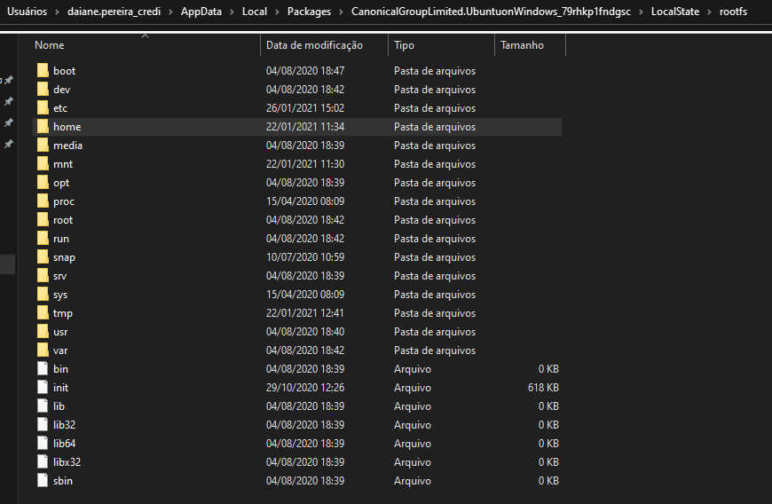

</section>

<section>  <h2 id = "Terminal"> Entendendo o Terminal </h2>
  Assim que abrimos o terminal nos deparamos com algo do tipo:
  

  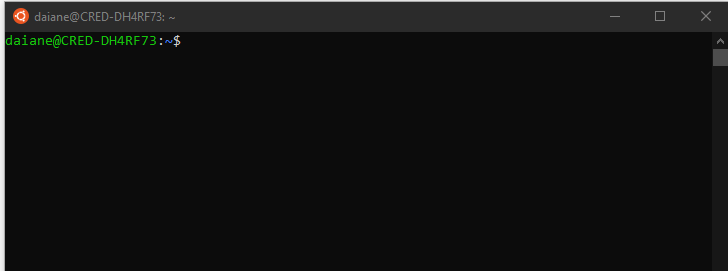

  O nome antes do @ na imagem significa o nome do usuário da máquina, já o nome após o @ é o nome da própria maquina. Neste caso o usuário é <i>daiane</i> e o nome da máquina é <i>CRED-DH4Rf73</i>
  
  O simbolo <b>~</b> significa que esta na pasta do usuário, já o simbolo <b>$</b> significa que é um usuário limitado, ou seja não consegue fazer tudo que o administrador faz
 </section>

 
 <section>
 <h2 id = "Comandos">Comandos Linux</h2>
  
  Irei listar os principais comandos utilizados no terminal do linux, e logo após uma breve explicação.
  
  * <b><i> pwd </i></b>  --> Mostra em qual pasta você está, se mostrar apenas uma barra ( / ), quer dizer que está na raiz do terminal.
   
  * <b><i> ls  </i></b>
  --> Mostra quais arquivos e pastas estão no diretório
  
  *  <b><i> ls -al   </i></b>
  --> Vai listar todos os arquivos e diretórios com informações detalhadas como permissões, tamanho, proprietário, etc.
  
  *  <b><i> clear  </i></b>
  --> Limpa todos os comandos do terminal, Ctrl + L tem a mesma função
   
   *  <b><i> exit  </i></b>
    --> Finaliza o terminal
    
   *  <b><i> history  </i></b>
   --> Ver todos os comandos executados
    
   *  <b><i>  su root  </i></b>
   --> Comando para trocar de usuário   

  *  <b><i>  su passwd root  </i></b>
   --> Comando para trocar senha do usuário   
  
  *  <b><i> cp  </i></b>
  --> Copia o arquivo para outro local, igual o Ctrl+ C
  
  *  <b><i> su root  </i></b>
  --> Entrar como administrador, vai solicitar do administrador.
  
   <h3 id="Pastas"> Mexendo com Pastas</h3>
  
  *  <b><i> mkdir  </i></b> <i>NOME DA PASTA</i>
  --> Comando para criar pastas, so funcionará se tiver permissão de administrador
  O Linux permite que seja criado pastas com nomes iguais desde que tenham diferença de maiúsculo ou minúsculo, 
   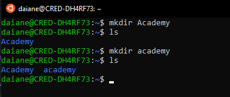
  
  *  <b><i> rmdir </i></b>  <i>NOME DA PASTA</i>
  --> Comando para apagar uma pasta. Se deseja apagar uma pasta que está dentro de outra, deve-se ir atéo diretório que a pasta se encontra.
  
  *  <b><i> rm </i></b>  <i>NOME DO ARQUIVO</i>
  --> Comando para apagar um arquivo. 
  
  *  <b><i> rm -r </i></b>  <i>NOME DA PASTA </i></b>
  --> Comando apagar uma pasta com varias coisas dentro
  
  *  <b><i> cd  </i></b> <i>NOME DA PASTA</i>
  --> Comando para abrir uma pasta
  
  *  <b><i> cd ..  </i></b>
  --> Comando para sair daquela pasta e ir para a anterior dela
  
  
  
  <h3 id="TextoTerminal"> Criando Arquivos de Texto pelo Terminal </h3>
  *  <b><i> nano NOMEdoArquivo  </i></b>
  --> Criar um novo arquivo de texto, irá abrir um terminal para digitar o texto do arquivo
      
   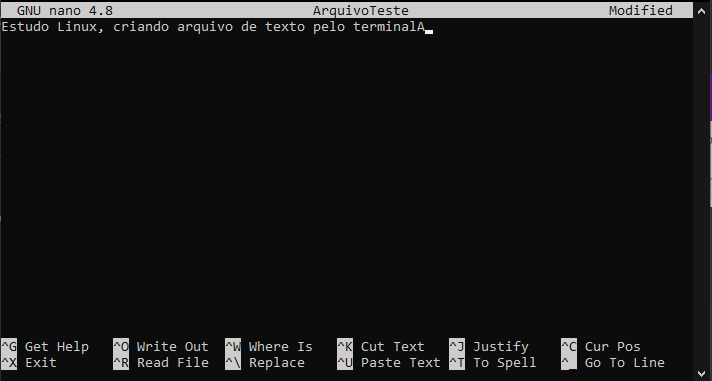
   
   * Crtl + X --> sai da edição, aperte Y para salvar ou N para não salvar as modificações feitas.E  logo em seguida confirme o nome, se estiver correto dê ENTER
   * Para editar novamente é o mesmo comando, irá abrir o arquivo já existente
      
 *  <b><i> cat NomedoArquivo  </i></b>
  --> Mostra no terminal o texto do arquivo
  
  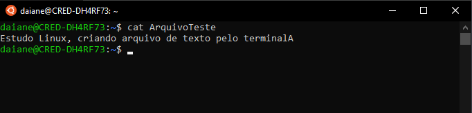
  
   
  O arquivo neste caso foi criando dentro da pasta <i>home/daiane</i>, Não esqueça do comando pwd caso queira ver onde está.
  
  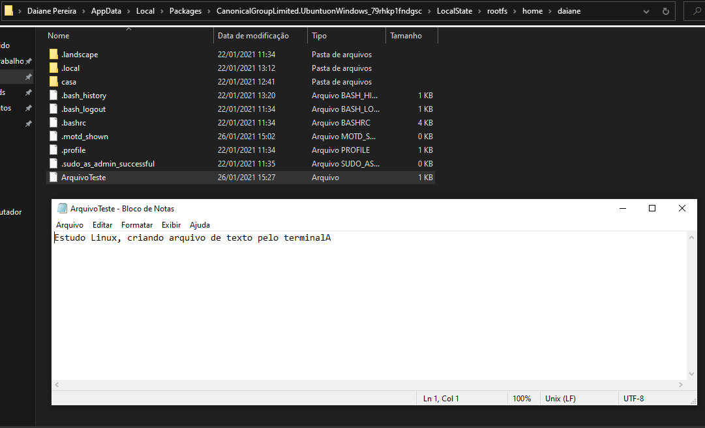
  
  
   <h3 id="Movimentando"> Movimento e Renomeando Arquivos e Pastas </h3>
  
  *  <b><i> mv LocadoArquivo/NomedoArquivo LOCALdoARQUIVO  </i></b>
  --> Mover arquivo para outro diretório
  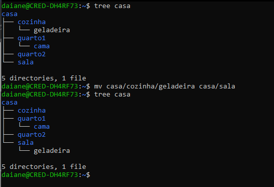
  
  --> Se estiver dentro da pasta onde o arquivo está, coloque o nome do arquivo e vá até a nova pasta.
   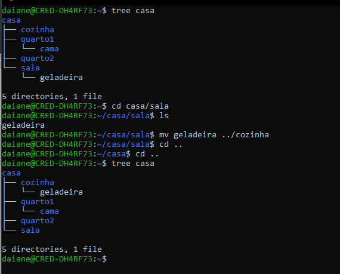
  
  
  *  <b><i> mv NOMEdoARQUIVO MESMOdiretório NovoNomedeArquivo  </i></b>
  --> Renomear arquivo
  
  *  <b><i> mv LOCALdaPasta NovoLocal  </i></b>
  --> Mover uma pasta para outro lugar. Exemplo, modifiquei o diretório TV que estava dentro de sala, para o diretório quarto1
  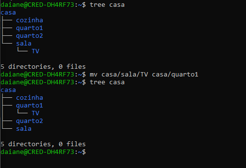
  
   *  <b><i> mv LOCALdaPasta LocaldaPastaComNovoNome  </i></b>
  --> Para renomear a pasta mova para mesmo local porém modificando o nome, exemplo, mudando o nome do dirétório TV para cama, o qual se encontra no casa/quarto1
   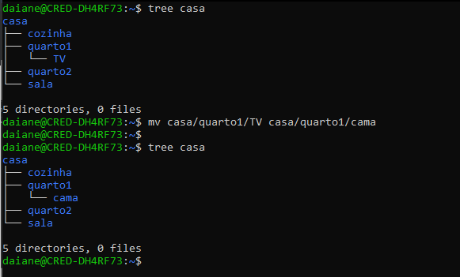
  
    
</section>

 <h2 id = "Aplicacoes">Aplicações - Tree </h2>
 Existem algumas aplicações que podemos instalar no terminal para facilitar.
 
 O Trre, é uma aplicação para melhor a visualização da ordem dos diretórios
 
  Para demostração, crie a pasta <i>casa</i>, dentro dela as pastas <i> cozinha, quarto1, quarto2, sala </i> e dentro de sala crie a pasta <i> TV </i>
  PS: para criar várias pastas é so colocar mkdir <i>pasta1 pasta2<i>, separados por um espaço
  
  Saia de dentro de todas as pastas e de o caman do <i>ls</i> para ver as pastas, repare que ela só irá mostrar a pasta casa, mas não mostra as dentro dela.
  
   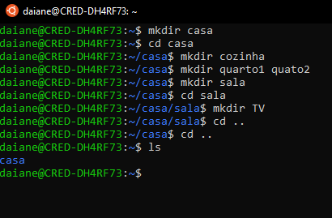
    
  Iremos instalar a aplicação e ver a diferença
  
  Instale a aplicação:
  * <i> sudo apt-get install tree </i>
  agora teste o comando : <i> tree casa </i>
   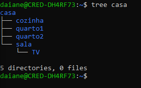
